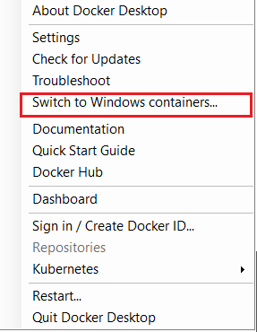
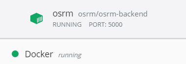
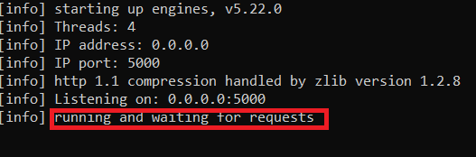

# HE_childcare_etl

## Download data

Run the `download_data_main.R` script. It will take awhile to download all the data.

Information about the data is recorded in Confluence [here](https://tpldocs.rice.edu/display/HEC/Data+v2.0).

## Data Management

Run the `manage_data_main.R` script. Before you will be able to run it follow the steps listed below:

### Geocoding

#### Mapquest API

To do the geocoding part of this ETL you will need to make an account from (mapquest)[https://developer.mapquest.com/plan_purchase/steps/business_edition/business_edition_free/register]. Then create an file called api_key.yaml. When you sign up for the Mapquest API you will start with the free version of the API, this means that you get 15000 free requests per month. Reverse geocoding or geocoding the CCL which is approximately 14,850 rows pretty much uses this threshold up. You can use multiple emails to sign up for different keys however.

The yaml file should have this structure.

```
mapquest:
  key: 	XXXXXXXXXXXXXXXXX  

```

#### Geocoding the data

The geocoding happens in this step which is in the `manage_data_main.R` script. To start the geocoding, change the geocoding parameter to `TRUE`.

```{r}
ccl <- dm.ccl(ccl_data_in_pth = data_in_pth,
              ccl_data_in_name = config$data_in_names$ccl,
              ccl_data_out_pth = data_out_pth,
              ccl_data_out_name = config$data_out_names$ccl,
              geocode = FALSE,
              key = api_key$mapquest$key)
```

The ccl file then gets used in the dm.family_prvdr_zip() function to create the family_prvdr_zip dataframe.

#### Testing HHSC CCL geocode quality

To test the quality of the latitudes and longitudes from the HHSC CCL raw data run the following code. When this code was run in July, the results showed 10% of the lat/long combos from the raw data were not even in Texas. Another 5% of the lat/long combos had counties which did not match the county from the HHSC CCL raw data.

```
ccl_address <- ccl %>%
  dplyr::filter(!is.na(latitude) & !is.na(longitude)) %>%
  dplyr::select(operation_number, latitude, longitude, county)

latLng <- lapply(1:nrow(ccl_address), function(add, df) {
  
  list(lat = df$latitude[add],
       lng = df$longitude[add])

}, df = ccl_address)

df <- dm.reverse_geocode(latLng = latLng,
                         key = api_key$mapquest$key)
```

### OSRM

Now run the `osrm_main.R` script. Before you will be able to run it follow the steps listed below.

OSRM (Open Source Routing Machine) is software developed to help people not only know the distance between two geographic coordinate points, but also the average duration of time between those two points.

To run the OSRM on docker, open a windows command prompt and run the following code. The code starts a server to run the osrm requests on. To get to this step, we took several other steps which are documented on [Confluence](https://tpldocs.rice.edu/display/HEC/OSRM).To extract the data required to run the osrm requests there was a lot of data to extract, which was done a more powerful computer (with more CPU and RAM). To replicate that process follow the steps outlined in Confluence, but be aware that memory and CPU settings may have to be adjusted.

If you running the following code it will open a server on port 5000. If you adjust which port the server is running on, make sure to adjust the port name in config.yaml as well.

Right now, the data used on the osrm process are stored in c:/docker. This is not the correct location to store these data, but docker is struggling with the mounted path (c:/26_HE/01_Childcare/Data), so the temporary fix is to put the data where we know docker looks for them.

#### Run docker command

1. Start docker by launching it from the windows search bar. Nothing will launch, which is confusing, but in the task bar you will see a little whale icon appear


2. Make sure docker is using linux containers. Right click on the docker whale icon and it should have a setting that says 'switch to windows containers', which indicates linux containers are currently in use.



3. Open a windows command prompt
4. Copy and paste the below docker command

```
docker run --name osrm -t -i -p 5000:5000 -v c:/docker:/data osrm/osrm-backend osrm-routed --algorithm mld /data/texas-latest.osrm
```

5. You will know the server is running if you open the docker dashboards UI and a container named "osrm"



6. Wait to run the R code until the server indicates it is waiting for requests



#### Run the R script

Then run the osrm_main.R script. If you get an error message like "Failed to connect to port", then the container did not launch correctly.

#### Notes

The docker command we should be running:
```
docker run --name osrm -t -i -p 5000:5000 -v m:/26_HE/01_Childcare/Data:/data osrm/osrm-backend osrm-routed --algorithm mld /data/texas-latest.osrm
```

Nothing should have to be changed in the R script.

