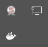

# HE_childcare_etl

## Data Management

Run the `main_data_collection.R` script. Before you will be able to run it follow the steps listed below:

### Geocodio API

1. Sign up for geocodio API key
2. Create a configuration file call api_key.yaml in the project root directory
3. Add a parameter to the configuration file called geocodio: key: XXX so the file looks like the sample file below

api_key.yaml
```
geocodio:
  key: xxx

```

### OSRM

Now run the `osrm_main.R` script. Before you will be able to run it follow the steps listed below.

OSRM (Open Source Routing Machine) is software developed to help people not only know the distance between two geographic coordinate points, but also the average duration of time between those two points.

To run the OSRM on docker, open a windows command prompt and run the following code. The code starts a server to run the osrm requests on. To get to this step, we took several other steps which are documented on [Confluence](https://tpldocs.rice.edu/display/HEC/OSRM).To extract the data required to run the osrm requests there was a lot of data to extract, which was done a more powerful computer (with more CPU and RAM). To replicate that process follow the steps outlined in Confluence, but be aware that memory and CPU settings may have to be adjusted.

If you running the following code it will open a server on port 5000. If you adjust which port the server is running on, make sure to adjust the port name in config.yaml as well.

Right now, the data used on the osrm process are stored in c:/docker. This is not the correct location to store these data, but docker is struggling with the mounted path (c:/26_HE/01_Childcare/Data), so the temporary fix is to put the data where we know docker looks for them.

#### Run docker command

1. Start docker by launching it from the windows search bar. Nothing will launch, which is confusing, but in the task bar you will see a little whale icon appear



2. Make sure docker is using linux containers. Right click on the docker whale icon and it should have a setting that says 'switch to windows containers', which indicates linux containers are currently in use.


3. Open a windows command prompt
4. Copy and paste the below docker command

```
docker run --name osrm -t -i -p 5000:5000 -v c:/docker:/data osrm/osrm-backend osrm-routed --algorithm mld /data/texas-latest.osrm
```

5. You will know the server is running if you open the docker dashboards UI and a container named "osrm"


6. Wait to run the R code until the server indicates it is waiting for requests


#### Run the R script

Then run the osrm_main.R script. If you get an error message like "Failed to connect to port", then the container did not launch correctly.

#### Notes

The docker command we should be running:
```
docker run --name osrm -t -i -p 5000:5000 -v m:/26_HE/01_Childcare/Data:/data osrm/osrm-backend osrm-routed --algorithm mld /data/texas-latest.osrm
```

Nothing should have to be changed in the R script.

